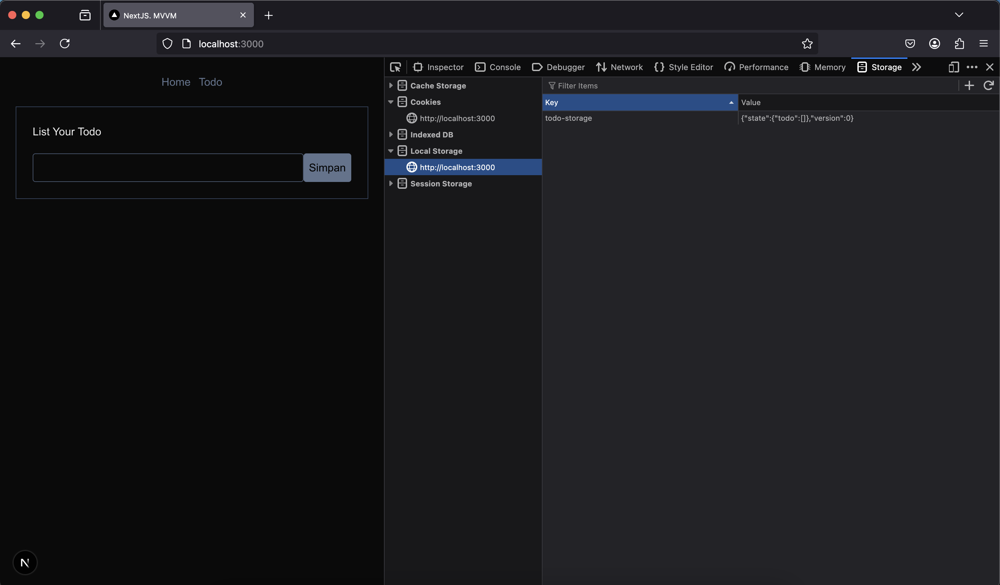
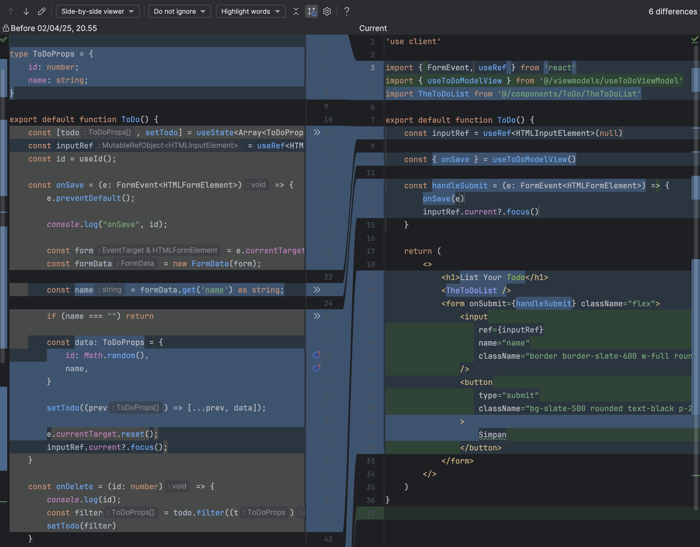
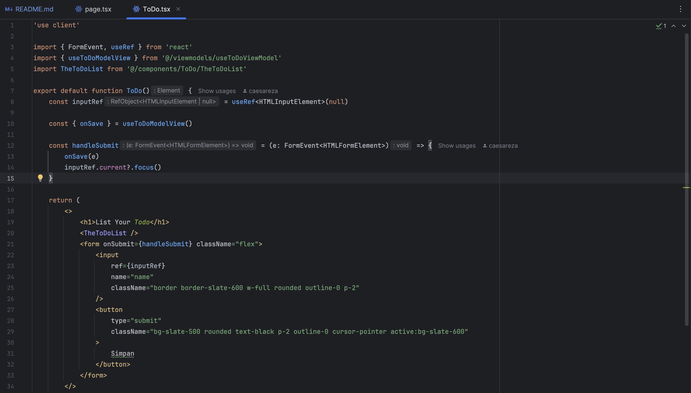

# NextJS. MVVM-style architecture

### Model-View-ViewModel (MVVM)
Docs [MVVM](https://learn.microsoft.com/en-us/dotnet/architecture/maui/mvvm) from microsoft.

The MVVM pattern helps cleanly separate an application's business and presentation logic from its user interface (UI). Maintaining a clean separation between application logic and the UI helps address numerous development issues and makes an application easier to test, maintain, and evolve. It can also significantly improve code re-use opportunities and allows developers and UI designers to collaborate more easily when developing their respective parts of an app.

## Project Screenshot

## Code Screenshot Before After

From the screenshot above, 
we move all our logic and function (onSave, onDelete, State Data) from the .JSX file
moved to src/viewmodels/useToDoModelView.ts file.

## Final Code Screenshot
we have separated the logic and the IU,
so we have a cleaner code for the UI.

